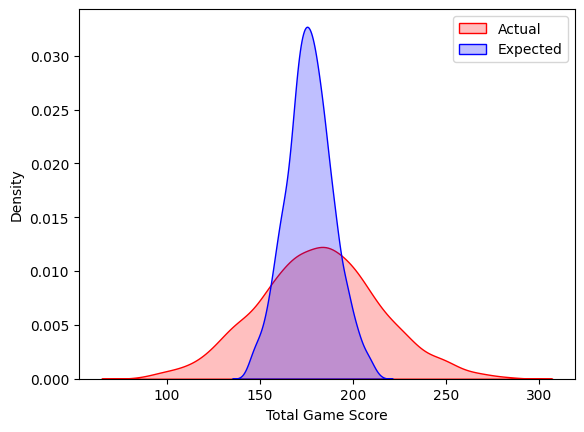
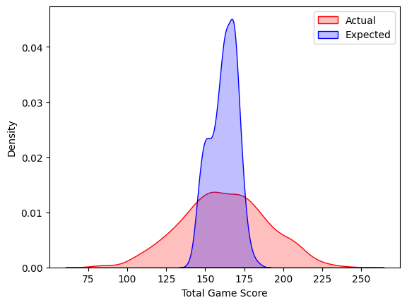

# Total Points Model

total-points-model is a Python library with useful functions and notebooks for tuning, training and evaluating an XGBoost model.

The target of this model is the Total Points Scored in an AFL match.

## Installation
Use the package manager [pip](https://pip.pypa.io/en/stable/) to install total-points-model.

```python
pip install total-points-model
```

## Usage

See notebooks folder for more comprehensive examples of usage.

### Data Processing
```python
from total_points_model.domain.preprocessing.data_preprocessor import DataPreprocessor
from total_points_model.domain.contracts.mappings import Mappings
from total_points_model.domain.contracts.rolling_columns import RollingColumns

preprocessor = DataPreprocessor(Mappings=Mappings, rolling_dict=RollingColumns.rolling_dict)

preprocessor.fit(training_data)

training_data_preproc = preprocessor.transform(training_data)
test_data_preproc = preprocessor.transform(test_data)

```
### Hyperparameter Tuning
```python
from total_points_model.domain.modelling.hyperparameter_tuning import XGBYearHyperparameterTuner
from total_points_model.domain.modelling.optuna_xgb_param_grid import OptunaXGBParamGrid

xgb_tuner = XGBYearHyperparameterTuner(X_train_preproc, y_train, optuna_grid=OptunaXGBParamGrid, monotonicity_constraints={})
xgb_tuner.tune_hyperparameters()
params = xgb_tuner.get_best_params()

```
### Model Building
```python
from total_points_model.domain.modelling.supermodel import SuperXGBRegressor


super_xgb = SuperXGBRegressor(X_train = X_train_preproc, 
                              y_train = y_train, 
                              X_test = X_test_preproc, 
                              y_test = y_test, 
                              params = params)

super_xgb.fit()

train_preds = super_xgb.predict(X_train_preproc.drop(columns=["Match_ID"]))
test_preds = super_xgb.predict(X_test_preproc.drop(columns=["Match_ID"]))
```
### Model Evaluation
```python
from total_points_model.domain.modelling.model_evaluation import XGBRegressorEvaluator
from total_points_model.domain.contracts.modelling_data_contract import ModellingDataContract

train_xgb_evals = XGBRegressorEvaluator(model = xgb_model,
                                       data = train_evaluation_data,
                                       actual_name = ModellingDataContract.RESPONSE,
                                       expected_name = "xgb_preds",
                                       compare_name='old_preds'
                                       )
train_xgb_evals.plot_distribution()
```

```python
test_xgb_evals = XGBRegressorEvaluator(model = xgb_model,
                                       data = test_evaluation_data,
                                       actual_name = ModellingDataContract.RESPONSE,
                                       expected_name = "xgb_preds",
                                       compare_name = "old_preds"
                                       )
test_xgb_evals.plot_distribution()
```


## Credits
Data sourced using a private R package. Credits to dgt23.

## CONTRIBUTING
I am no longer updating this package as I am exploring other AFL related analysis and packages.

## License

[MIT](https://choosealicense.com/licenses/mit/)


